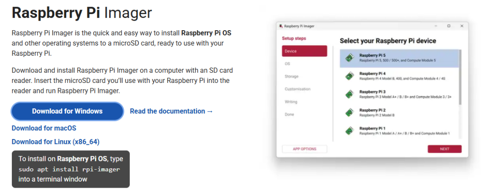
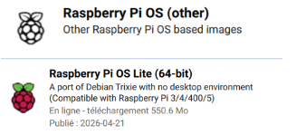
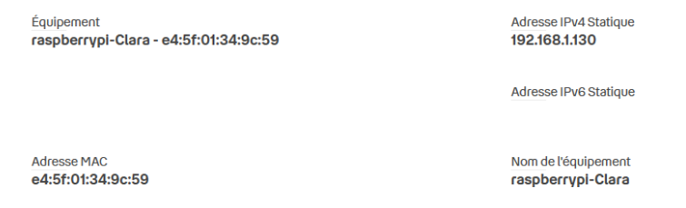
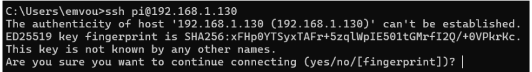
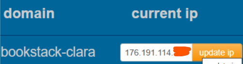

# 🗂️ Projet — Serveur BookStack sur Raspberry Pi 4

> **Contexte :** Projet personnel réalisé dans le cadre du BTS SIO option SISR.  
> **Objectif :** Déployer un wiki personnel auto-hébergé, sécurisé et accessible depuis n'importe où dans le monde.

---

## Sommaire

1. [Présentation du projet](#présentation-du-projet)
2. [Matériel utilisé](#matériel-utilisé)
3. [Architecture technique](#architecture-technique)
4. [Étapes de réalisation](#étapes-de-réalisation)
   - [Étape 1 — Déballage et inspection du matériel](#étape-1--déballage-et-inspection-du-matériel)
   - [Étape 2 — Préparation de la carte microSD](#étape-2--préparation-de-la-carte-microsd)
   - [Étape 3 — Premier démarrage du Raspberry Pi](#étape-3--premier-démarrage-du-raspberry-pi)
   - [Étape 3.5 — Fixer l'adresse IP du Pi (bail DHCP statique)](#étape-35--fixer-ladresse-ip-du-pi-bail-dhcp-statique)
   - [Étape 4 — Connexion SSH et prise en main à distance](#étape-4--connexion-ssh-et-prise-en-main-à-distance)
   - [Étape 5 — Nom de domaine dynamique (DuckDNS)](#étape-5--nom-de-domaine-dynamique-duckdns)
   - [Étape 6 — Déploiement des services avec Docker](#étape-6--déploiement-des-services-avec-docker)
   - [Étape 7 — Redirection de ports (NAT/PAT)](#étape-7--redirection-de-ports-natpat)
   - [Étape 8 — Sécurisation HTTPS avec Let's Encrypt](#étape-8--sécurisation-https-avec-lets-encrypt)
   - [Étape 9 — Résultat final et tests](#étape-9--résultat-final-et-tests)
5. [Compétences acquises](#compétences-acquises)
6. [Difficultés rencontrées](#difficultés-rencontrées)
7. [Pistes d'amélioration](#pistes-damélioration)

---

## Présentation du projet

L'objectif de ce projet était de transformer un **Raspberry Pi 4** en serveur web hébergeant une instance **BookStack** — un wiki open source permettant d'organiser de la documentation, des procédures et des notes techniques.

**Pourquoi ce projet ?**

Un PC classique branché en permanence consomme trop d'électricité pour servir de serveur domestique. Les solutions cloud (VPS) existent, mais le choix a été fait d'héberger les données sur une machine physique personnelle, pour des raisons de maîtrise des données et d'apprentissage concret de la configuration serveur. Un NAS aurait aussi été envisageable, mais plus coûteux et moins formateur qu'une configuration réalisée de zéro.

Le Raspberry Pi 4 (faible consommation, format compact, architecture ARM) est parfaitement adapté à ce cas d'usage.

---

## Matériel utilisé

| Composant | Rôle | Prix indicatif |
|---|---|---|
| Raspberry Pi 4 (4 Go de RAM) | Serveur principal | ~70 € |
| Carte microSD 32 Go (classe 10) | Stockage système et données | ~12 € |
| Adaptateur microSD → USB | Flashage de la carte depuis le PC | ~5 € |
| Câble alimentation USB-C (5V/3A) | Alimentation du Pi | ~10 € |
| Câble Ethernet | Connexion filaire stable à la box | ~5 € |
| PC sous Windows (machine principale) | Administration à distance via SSH | — |

---

## Architecture technique

```
Internet
    │
    ▼
Box (routeur) — Redirection ports 80 et 443
    │
    ▼
Raspberry Pi 4 (IP locale fixe réservée par bail DHCP)
    │
    └── Docker Compose
          ├── bookstack           (application wiki, port 80 interne)
          ├── bookstack_db        (base de données MariaDB)
          └── nginx-proxy-manager (reverse proxy, ports 80 / 443 / 81)
                  │
                  └── Certificat SSL Let's Encrypt
                        → https://bookstack-clara.duckdns.org
```

---

## Étapes de réalisation

### Étape 1 — Déballage et inspection du matériel

On identifie et vérifie chaque composant avant de commencer :

- **Le Raspberry Pi 4** : carte verte rectangulaire avec ports USB, Ethernet, micro-HDMI et USB-C (alimentation).
- **La carte microSD** : support de stockage du système.
- **Le câble USB-C** : il doit obligatoirement délivrer **5V / 3A** minimum — une alimentation insuffisante provoque des instabilités.
- **Le câble Ethernet** : connexion filaire à la box, plus stable que le Wi-Fi pour un serveur.

> ⚠️ On ne branche pas encore l'alimentation. La carte microSD doit être préparée en premier depuis le PC.

---

### Étape 2 — Préparation de la carte microSD

On utilise l'outil officiel **Raspberry Pi Imager** (téléchargeable sur [raspberrypi.com/software](https://www.raspberrypi.com/software)) pour flasher l'OS sur la carte.



**Image choisie :** `Raspberry Pi OS Lite (64-bit)` **chemin : others -> PiOS Lite** — sans interface graphique, pour dédier toutes les ressources du Pi au serveur.



Avant de lancer l'écriture, on configure les paramètres avancés directement dans Raspberry Pi Imager :

| Paramètre | Valeur configurée |
|---|---|
| Nom d'utilisateur | `pi` |
| Mot de passe | (défini à la configuration) |
| SSH | **Activé** (authentification par mot de passe) |
| Raspberry Pi Connect | Non activé (inutile sans interface graphique) |

> 💡 SSH est indispensable : le Pi est utilisé sans écran ni clavier, c'est le seul moyen de le piloter à distance.

L'écriture prend entre 3 et 10 minutes. Une fois terminée, on éjecte proprement la carte.

---

### Étape 3 — Premier démarrage du Raspberry Pi

On assemble et démarre le Pi dans l'ordre suivant :

1. Insertion de la carte microSD (contacts dorés vers le bas, côté circuit imprimé)
2. Branchement du câble Ethernet sur la box
3. Branchement du câble d'alimentation USB-C → le Pi démarre automatiquement

On attend **3 minutes complètes** sans rien toucher : le Pi génère ses clés de sécurité et initialise le système au premier démarrage. La DEL verte clignote irrégulièrement pendant cette phase.

---

### Étape 3.5 — Fixer l'adresse IP du Pi (bail DHCP statique)


Par défaut, la box attribue les adresses IP dynamiquement (DHCP). Si l'adresse du Pi change après une coupure, deux problèmes apparaissent : la connexion SSH devient invalide, et les redirections de ports configurées à l'étape 7 pointent vers une adresse qui n'existe plus.

**Solution :** on crée un **bail DHCP statique** dans l'interface de la box. On associe l'adresse MAC du Pi à une IP fixe choisie (ex : `192.168.1.130`). La box reconnaît le Pi à son adresse MAC et lui attribue toujours la même IP.



| Opérateur | Où trouver la réservation d'IP |
|---|---|
| Orange (Livebox) | Réseau avancé > DHCP > Baux statiques |
| SFR (BBox) | Réseau > Réseau local > Baux DHCP statiques |
| Free (Freebox) | Freebox OS > Paramètres > Mode avancé > DHCP > Baux statiques |
| Bouygues (Bbox) | Réseau avancé > DHCP > Réservations |

| Sans réservation d'IP | Avec réservation d'IP |
|---|---|
| L'IP peut changer après redémarrage → SSH cassé, BookStack inaccessible depuis l'extérieur | L'IP est toujours identique → SSH et redirections de ports restent valides en permanence |

---

### Étape 4 — Connexion SSH et prise en main à distance


On récupère l'IP locale du Pi depuis l'interface de la box (section « Appareils connectés », appareil nommé `raspberrypi`), puis on se connecte depuis le terminal Windows :

```bash
ssh pi@192.168.1.130  pi = nom que vous avez donné a votre serveur Raspberry à l'étape 2
```


À la première connexion, on accepte l'empreinte de clé (`yes`), puis on saisit le mot de passe configuré à l'étape 2. Le mot de passe ne s'affiche pas à l'écran pendant la saisie — c'est normal.

Si le prompt `pi@raspberrypi:~$` apparaît, la connexion est établie et on peut administrer le Pi à distance.

---

### Étape 5 — Nom de domaine dynamique (DuckDNS)

L'adresse IP publique fournie par l'opérateur change régulièrement. Pour accéder au serveur via une URL stable depuis n'importe où, on utilise **DuckDNS** — un service de DNS dynamique gratuit.

DuckDNS crée un sous-domaine (ex : `bookstack-clara.duckdns.org`) et le fait pointer automatiquement vers l'IP publique actuelle de la connexion.

**Création du domaine :**
1. Se connecter sur [duckdns.org](https://www.duckdns.org) (avec un compte Google ou GitHub)
2. Saisir le nom souhaité dans le champ « sub domain »
3. Cliquer sur **add domain**


Voici l'IP publique actuelle (ex: 176.XX.XX.XX)



> ⚠️ Le nom de domaine est utilisé dans les fichiers de configuration des étapes suivantes. Il ne faut pas le changer ensuite.

---

### Étape 6 — Déploiement des services avec Docker

**Installation de Docker sur le Pi :**

```bash
curl -sSL https://get.docker.com | sh
sudo usermod -aG docker $USER
```


On se déconnecte puis reconnecte en SSH pour appliquer les droits, puis on crée le dossier de travail :

```bash
mkdir bookstack && cd bookstack
nano docker-compose.yml
```

Le fichier `docker-compose.yml` orchestre trois conteneurs :

| Conteneur | Image | Rôle |
|---|---|---|
| `bookstack` | `linuxserver/bookstack` | Application wiki (interface web) |
| `bookstack_db` | `linuxserver/mariadb` | Base de données relationnelle |
| `nginx-proxy-manager` | `jc21/nginx-proxy-manager` | Reverse proxy + SSL |

**Extrait du fichier de configuration :**

```yaml
services:
  bookstack:
    image: lscr.io/linuxserver/bookstack:latest
    environment:
      - TZ=Europe/Paris
      - APP_URL=https://bookstack-clara.duckdns.org
      - DB_HOST=bookstack_db
      - DB_USER=bookstack
      - DB_PASS=mot_de_passe_db
    volumes:
      - ./config:/config
    restart: unless-stopped
    depends_on:
      - bookstack_db

  bookstack_db:
    image: lscr.io/linuxserver/mariadb:latest
    environment:
      - MYSQL_DATABASE=bookstackapp
      - MYSQL_USER=bookstack
      - MYSQL_PASS=mot_de_passe_db
    volumes:
      - ./db_config:/config
    restart: unless-stopped

  nginx-proxy-manager:
    image: jc21/nginx-proxy-manager:latest
    ports:
      - '80:80'
      - '443:443'
      - '81:81'
    volumes:
      - ./npm/data:/data
      - ./npm/letsencrypt:/etc/letsencrypt
    restart: unless-stopped
```

La directive `restart: unless-stopped` garantit le redémarrage automatique des services après une coupure de courant.

**Démarrage de tous les services :**

```bash
docker compose up -d
```

**Vérification :**

```bash
docker ps
```

On doit voir 3 lignes avec le statut `Up` : `bookstack`, `bookstack_db` et `nginx-proxy-manager`.

---

### Étape 7 — Redirection de ports (NAT/PAT)

<!-- 📸 Capture de l'interface de la box, section redirection de ports -->

Le serveur tourne sur le réseau local mais reste invisible depuis Internet. On configure la box pour rediriger les connexions entrantes vers le Pi :

| Nom de la règle | Port externe | Port interne | IP de destination |
|---|---|---|---|
| Web-HTTP | 80 | 80 | IP locale du Pi (ex : 192.168.1.130) |
| Web-HTTPS | 443 | 443 | IP locale du Pi (ex : 192.168.1.130) |

| Opérateur | Où trouver la redirection de ports |
|---|---|
| Orange (Livebox) | Réseau avancé > NAT/PAT |
| SFR (BBox) | Réseau > NAT/PAT |
| Free (Freebox) | Freebox OS > Paramètres > Mode avancé > Redirections |
| Bouygues (Bbox) | Réseau avancé > Redirections de ports |

> 💡 Le port 80 est nécessaire pour la validation des certificats Let's Encrypt. Le port 443 gère le trafic HTTPS chiffré.

---

### Étape 8 — Sécurisation HTTPS avec Let's Encrypt

<!-- 📸 Capture de l'interface Nginx Proxy Manager avec le certificat SSL actif -->

On accède à l'interface de Nginx Proxy Manager depuis le navigateur du PC :

```
http://192.168.1.130:81
```

On se connecte (identifiants par défaut : `admin@example.com` / `changeme`) et on les modifie immédiatement.

**Configuration du Proxy Host :**

| Champ | Valeur |
|---|---|
| Domain Names | `bookstack-clara.duckdns.org` |
| Scheme | `http` |
| Forward Hostname / IP | `bookstack` (nom du conteneur Docker) |
| Forward Port | `80` |
| Block Common Exploits | ✅ Coché |

**Onglet SSL :**
- SSL Certificate : `Request a new SSL Certificate`
- Force SSL : ✅ (redirige automatiquement HTTP → HTTPS)
- Acceptation des CGU Let's Encrypt : ✅

Le certificat est généré en 30 à 60 secondes et se renouvelle automatiquement tous les 90 jours.

---

### Étape 9 — Résultat final et tests

<!-- 📸 Capture de BookStack affiché dans un navigateur mobile avec le cadenas HTTPS -->

**Test depuis l'extérieur du réseau :** on désactive le Wi-Fi du smartphone pour passer en 4G, puis on accède à :

```
https://bookstack-clara.duckdns.org
```

La page BookStack s'affiche avec le cadenas HTTPS dans la barre d'adresse.

**Première connexion :** identifiants par défaut `admin@admin.com` / `password` — à changer immédiatement dans le profil.

---

## Compétences acquises

### Administration système Linux
- Flash d'une image OS et premier démarrage en mode headless (sans écran)
- Administration entièrement en ligne de commande : gestion des paquets (`apt`), navigation dans l'arborescence, édition de fichiers de configuration (`nano`)
- Gestion des permissions Linux (`chmod`, `chown`)

### Conteneurisation avec Docker
- Installation de Docker sur architecture ARM
- Rédaction d'un fichier `docker-compose.yml` multi-services
- Persistance des données via volumes Docker
- Supervision des conteneurs (`docker ps`, `docker compose logs`)

### Réseau et services web
- Adressage IP et réservation de bail DHCP statique sur box opérateur
- Configuration de redirections de ports (NAT/PAT)
- DNS dynamique avec DuckDNS
- Configuration d'un reverse proxy (Nginx Proxy Manager)

### Sécurité
- Administration à distance sécurisée via SSH
- Déploiement d'un certificat SSL/TLS avec Let's Encrypt
- Renouvellement automatique du certificat
- Cloisonnement des services par conteneurs Docker

---

## Difficultés rencontrées

| Difficulté | Solution apportée |
|---|---|
| Adresse IP du Pi changeante après redémarrage | Réservation d'IP fixe (bail DHCP statique) dans l'interface de la box |
| Services inaccessibles depuis l'extérieur | Vérification et correction des règles NAT/PAT + mise à jour DuckDNS |
| Erreur 500 au premier lancement de BookStack | Attente de l'initialisation complète de la base de données MariaDB |
| Erreur lors de la génération du certificat SSL | Vérification que les ports 80 et 443 étaient bien ouverts dans la box |

---

## Pistes d'amélioration

- **Sauvegardes automatisées** : script cron pour sauvegarder la base de données SQL et les fichiers BookStack (la carte SD est fragile)
- **Accès VPN (Tailscale)** : supprimer l'exposition publique du serveur en le rendant accessible uniquement via VPN WireGuard, tout en conservant l'accès distant
- **Monitoring** : ajout d'un outil de supervision (Uptime Kuma, Netdata) pour surveiller la disponibilité du serveur
- **Migration vers SSD** : remplacement de la carte SD par un SSD USB pour améliorer la durabilité et les performances en lecture/écriture

---

*Projet réalisé dans le cadre du BTS SIO option SISR — Clara B.*
